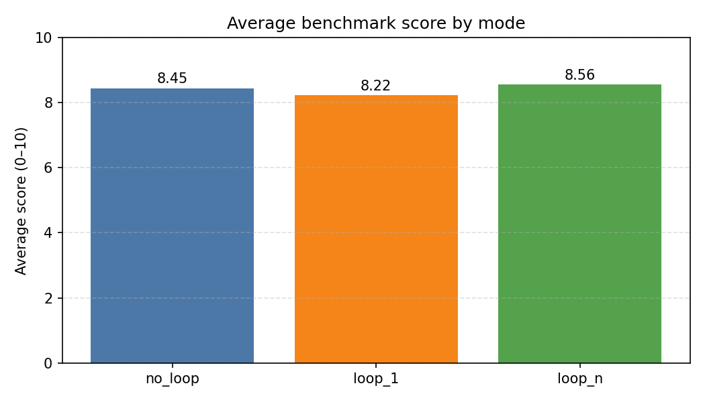
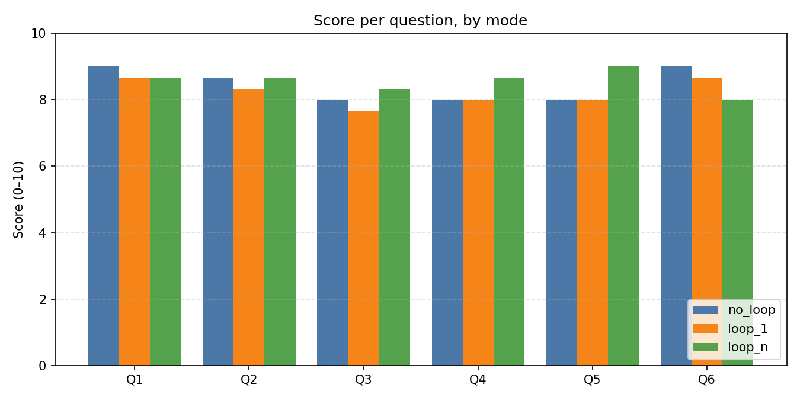
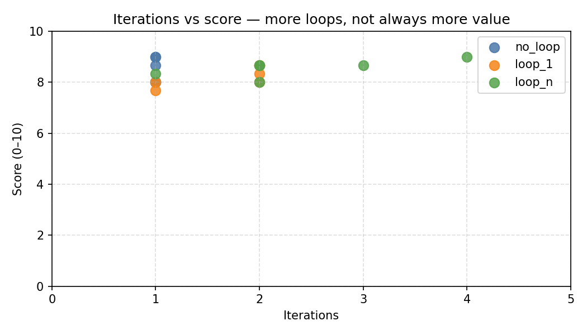

# Auto-Research Loop with Self-Critique and Persistent Memory

**FINM Agentic AI - Final Project Writeup**

**Team:** Claire Kim, John Beecher, Sankalp Yadav, Zara Nip

**Date:** May 2026

[Repository on GitHub](https://github.com/zaranip/gen-ai-final-project) · [Raw report](https://github.com/zaranip/gen-ai-final-project/blob/main/reports/final_report.md) · [Consolidated CSV](https://github.com/zaranip/gen-ai-final-project/blob/main/outputs/benchmark_runs/consolidated/summary.csv)

---

## The Question

Does adding a self-critique loop and persistent memory make a macroeconomic
research agent better on open-ended, FRED-backed questions?

Our answer is qualified. In the clean final run, the full `loop_n` system scored
slightly higher than the single-shot baseline, but the gain was small relative to
the extra cost and latency. The main practical lesson is not "always iterate."
It is that critique helps when definitions are ambiguous and can hurt when the
baseline already answers a clean timing question.

## Method

Three configurations of the same agent were scored on the same six questions:

| Mode | What it does |
|---|---|
| `no_loop` | One researcher pass. No critic, no memory. |
| `loop_1` | Researcher -> critic -> at most one revision pass. No memory across runs. |
| `loop_n` | Iterative researcher/critic loop, capped at 4 iterations, with persistent memory across the benchmark run. |

The researcher runs on `claude-opus-4-7`. The critic runs on
`claude-sonnet-4-6`, deliberately a different model, and independently re-fetches
FRED data instead of trusting the researcher's draft. The evaluator runs on
`claude-haiku-4-5-20251001` against hand-curated reference answers.

After a smoke run exposed scope drift on Q1, we added scope-discipline
instructions to both the researcher and critic: if a question names a historical
window, answer that window first and label later data as a caveat rather than
changing the target question.

## Reference Verification

Before the final run, all six reference answers were re-verified against primary
FRED data. The audit trail is in
[`reports/reference_answer_verification.md`](https://github.com/zaranip/gen-ai-final-project/blob/main/reports/reference_answer_verification.md).

That audit corrected several benchmark references:

- Q1 now acknowledges the negative 2022 Q1 GDP quarter while preserving the
  no-NBER-recession soft-landing conclusion.
- Q2 now uses the verified 2006-2007 10Y-2Y trough of about -20 bps, not the
  earlier -50 to -70 bps estimate.
- Q3 now uses a real AHE decline of about -2.4% YoY at the June 2022 CPI peak.
- Q4 now uses current FRED vintages: about +4.8M leisure and hospitality jobs
  versus +1.9M professional and business services jobs from Apr 2020 to Apr 2021.

## Benchmark

| ID | Question | Difficulty |
|---|---|---|
| Q1 | Did the Fed achieve a soft landing in 2022-2023? | medium |
| Q2 | Was the 2022-2023 yield curve inversion more persistent than 2006-2007? | easy |
| Q3 | Did real wages grow or decline during the 2021-2022 inflation surge? | easy |
| Q4 | Did leisure and hospitality or professional services drive the post-COVID jobs recovery? | medium |
| Q5 | Did M2 acceleration lead the 2021-2022 CPI surge? | hard |
| Q6 | Did unemployment lead or lag GDP in 2008-2009? | easy |

Final results come from run `final_20260528_0340`:

```bash
python -m scripts.run_benchmark \
  --modes no_loop loop_1 loop_n \
  --max-iterations 4 \
  --run-id final_20260528_0340
```

## Results

### Mode averages

| Mode | Avg Score | Total Cost | Avg Iterations |
|---|---:|---:|---:|
| `no_loop` | 8.45 | $2.94 | 1.00 |
| `loop_1` | 8.22 | $6.45 | 1.67 |
| `loop_n` | **8.56** | $11.04 | 2.33 |



`loop_n` won the average by 0.11 points over baseline, but cost about 3.8x as
much. `loop_1` performed worse than baseline, suggesting one critic pass can add
complexity without enough room for the system to recover from a bad revision
direction.

### Question-level scores

| Question | no_loop | loop_1 | loop_n | Delta loop_n - no_loop |
|---|---:|---:|---:|---:|
| Q1 | 9.00 | 8.67 | 8.67 | -0.33 |
| Q2 | 8.67 | 8.33 | 8.67 | 0.00 |
| Q3 | 8.00 | 7.67 | 8.33 | +0.33 |
| Q4 | 8.00 | 8.00 | 8.67 | +0.67 |
| Q5 | 8.00 | 8.00 | **9.00** | +1.00 |
| Q6 | **9.00** | 8.67 | 8.00 | -1.00 |



## When The Loop Helped: Q5

Q5 asked whether M2 growth led the 2021-2022 CPI surge. The baseline was good:
it identified the 12-16 month lag and correctly cautioned against treating M2 as
a mechanical rule.

`loop_n` improved the answer to 9.00 by forcing cleaner definitions. It separated
three timing claims:

- M2 YoY first jumping above roughly 10% in March 2020 to CPI YoY breaking above
  4% in April 2021: 13 months.
- M2 YoY peak in February 2021 to CPI YoY peak in June 2022: 16 months.
- M2 level peak in March 2022 to CPI YoY peak: only about 3 months.

That is the best case for iterative critique in this project: the critic made
the answer more precise without changing the question.

## When The Loop Hurt: Q6

Q6 is the required failure case. The baseline scored 9.00 with a concise answer:
real GDP troughed in 2009 Q2, unemployment peaked at 10.0% in October 2009, so
unemployment lagged GDP by about 1-2 quarters.

`loop_n` dropped to 8.00. It added correct but distracting nuance about downturn
timing, NBER monthly peaks versus quarterly GDP peaks, and whether unemployment
was coincident or slightly leading at recession entry. That nuance is defensible,
but it obscured the cleaner recovery-side answer the question was really asking
for.

The loop did not hallucinate. It over-explained.

## Cost And Practicality

The final full run cost estimate was $20.44 total:

| Mode | Total Cost | Approx Cost Per Question |
|---|---:|---:|
| `no_loop` | $2.94 | $0.49 |
| `loop_1` | $6.45 | $1.08 |
| `loop_n` | $11.04 | $1.84 |



The economics are mixed. `loop_n` produced the best average result, but the score
gain was small. It is most defensible on questions where definitions are
ambiguous and extra checking changes answer quality, such as Q5.

## Limitations

- **n = 6.** This is a proof-of-concept, not a statistical benchmark.
- **LLM judge subjectivity.** Scores come from one evaluator prompt and one model.
- **Reference sensitivity.** We found and corrected several reference values,
  which is why the primary-data audit matters.
- **Cost sensitivity.** Model pricing and latency change whether loops are worth
  running.
- **Memory scope.** Memory is shared across benchmark questions; that may help
  related macro concepts and hurt when questions are only loosely related.
- **Structured-output leakage.** Two final answers leaked XML-like field labels
  into the `claim` field. We normalized those artifacts for reporting and added a
  repair step to the benchmark runner.

## What We'd Change Next

- Add a cheap scope-guard judge after critic feedback.
- Score every iteration so we can see where answer quality peaks.
- Separate factual memory from process memory.
- Add a small human-grading pass for the six final answers.
- Try a second domain to test whether the pattern generalizes beyond FRED macro
  questions.

## What The AI Tool Would Not Have Produced On Its Own

- The benchmark question design: six FRED questions chosen to require reasoning,
  not recall.
- The primary-data reference audit and corrections.
- The decision to report a small, cost-qualified improvement rather than a broad
  "loops solve research" claim.
- The Q6 failure interpretation: the loop hurt by overcomplicating a clean
  answer, not by making a simple factual error.

## AI Usage Statement

Claude Code was used as a development assistant to scaffold and revise code,
tests, documentation, and report language. The research agent used Anthropic
models through the API:

- Researcher: `claude-opus-4-7`
- Critic: `claude-sonnet-4-6`
- Evaluator: `claude-haiku-4-5-20251001`

Benchmark questions and reference answers were hand-curated by the team and then
re-verified against primary FRED series. Agent outputs were not used as
ground-truth reference answers.

## Reproducibility

```bash
pip install -r requirements.txt
cp .env.example .env  # fill in ANTHROPIC_API_KEY and FRED_API_KEY
python -m unittest discover -v
python -m compileall src benchmark scripts tests
python -m scripts.verify_references
python -m scripts.run_benchmark --modes no_loop loop_1 loop_n --max-iterations 4
python -m scripts.build_charts
```

Artifacts land in `outputs/benchmark_runs/<run_id>/`:

- `run_config.json` - exact settings
- `raw_results.json` - every claim, critique, score, and token count
- `summary.csv` - flat table for plotting
- `summary.md` - same digest in markdown

The published chartbook uses `outputs/benchmark_runs/consolidated/`.

## Part Distributions

- **Claire** - researcher/critic split, why a different model for the critic,
  structured tool-output schemas, why the critic independently re-fetches FRED
  data.
- **John** - benchmark construction, FRED-based reference verification, why these
  six questions resist simple lookup.
- **Sankalp** - reproducibility scaffolding, the `loop_1` one-revision semantics,
  result aggregation pipeline, test coverage.
- **Zara** - proposal-to-writeup framing, the Q6 failure case, limitations, AI
  usage disclosure.

---

## References

- Self-Refine (Madaan et al., NeurIPS 2023) - iterative LLM refinement with self-feedback. [arXiv:2303.17651](https://arxiv.org/abs/2303.17651)
- Reflexion (Shinn et al., NeurIPS 2023) - verbal reinforcement via episodic memory. [arXiv:2303.11366](https://arxiv.org/abs/2303.11366)
- Macroeconomic Forecasting with LLMs - FRED-MD benchmark context. [arXiv:2407.00890](https://arxiv.org/abs/2407.00890)
